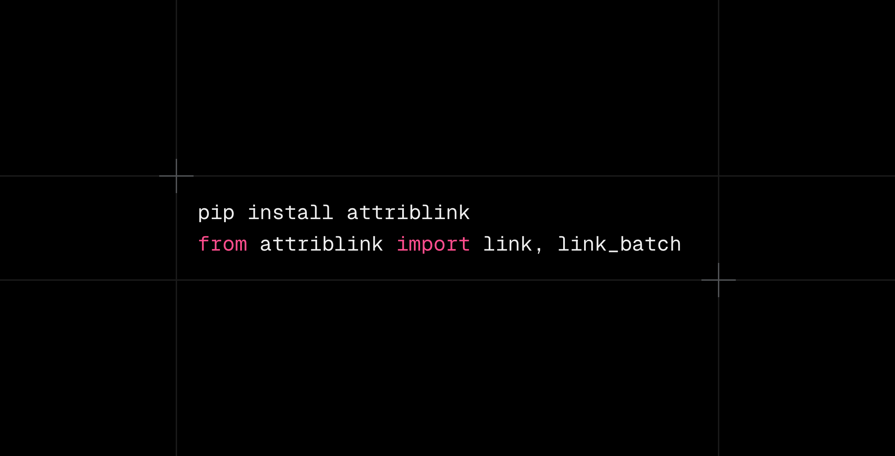

# attriblink



[](https://pypi.org/project/attriblink/)
[](https://pypi.org/project/attriblink/)
[](https://github.com/george-dominic/attriblink/actions/workflows/test.yml)

Multi-period attribution linking for portfolio returns.

## Overview

Attribution linking is a technique used in investment performance analysis to decompose portfolio returns across multiple periods while preserving additivity. This package provides implementations of linking methods, starting with the Carino method.

> **Note:** This library is currently in **alpha**. APIs may evolve.

For full documentation, see [DOCS.md](./DOCS.md).

## Installation

```bash
pip install attriblink
```

## Usage

### Basic Usage (Decimal)

```python
import pandas as pd
from attriblink import link

# Quarterly portfolio and benchmark returns
portfolio_returns = pd.Series(
    [0.025, 0.035, -0.012, 0.048],
    index=pd.date_range("2025-01-01", periods=4, freq="ME")
)
benchmark_returns = pd.Series(
    [0.018, 0.028, -0.015, 0.038],
    index=portfolio_returns.index
)

# Attribution effects from Brinson-Fachler
effects = pd.DataFrame({
    "allocation":    [0.005, 0.006, 0.002, 0.008],
    "selection":     [0.003, 0.002, -0.001, 0.004],
    "interaction":   [0.001, 0.001, 0.000, 0.002]
}, index=portfolio_returns.index)

# Link effects using Carino method
result = link(effects, portfolio_returns, benchmark_returns)

# View results
print(result.summary())

# Access individual effects
print(f"Allocation: {result['allocation']:.4%}")
print(f"Selection:  {result['selection']:.4%}")

# k-factor interpretation
print(f"k-factor: {result.k_factor:.4f}")
# k > 1: volatile excess returns, k < 1: consistent excess
```

### Using Basis Points (BPS)

If your data is in basis points, use the `unit` parameter:

```python
import pandas as pd
from attriblink import link

# Returns in decimal
portfolio_returns = pd.Series([0.02, 0.03], index=pd.date_range("2024-01-01", periods=2, freq="ME"))
benchmark_returns = pd.Series([0.015, 0.02], index=portfolio_returns.index)

# Effects in basis points (e.g., 50 bps = 0.50%)
effects_bps = pd.DataFrame({
    "allocation": [50, 80],
    "selection": [20, 50]
}, index=portfolio_returns.index)

result = link(effects_bps, portfolio_returns, benchmark_returns, unit="bps")
print(result.summary())
```

### Using Percent

Similarly for percentage input:

```python
# Effects in percent (e.g., 5% = 5, not 0.05)
effects_percent = pd.DataFrame({
    "allocation": [0.5, 0.8],
    "selection": [0.2, 0.5]
}, index=portfolio_returns.index)

result = link(effects_percent, portfolio_returns, benchmark_returns, unit="percent")
```

### Batch Processing (Multiple Funds)

For processing multiple funds from a single DataFrame (e.g., from Snowflake):

```python
import pandas as pd
from attriblink import link_batch

# Long-format DataFrame from Snowflake/warehouse
data = pd.DataFrame({
    "date": ["2024-01-31", "2024-01-31", "2024-02-28", "2024-02-28"],
    "fund_id": ["fund_a", "fund_b", "fund_a", "fund_b"],
    "allocation": [0.5, 0.3, 0.8, 0.6],
    "selection": [0.2, 0.1, 0.5, 0.3],
    "portfolio_return": [0.02, 0.015, 0.03, 0.025],
    "benchmark_return": [0.015, 0.01, 0.02, 0.018]
})

result = link_batch(
    data,
    group_by="fund_id",
    date_col="date",
    effects_cols=["allocation", "selection"],
    portfolio_col="portfolio_return",
    benchmark_col="benchmark_return",
)

# Returns DataFrame with linked effects for all funds:
# DATE       | FUND_ID | portfolio_return | benchmark_return | active_return | allocation | selection
# 2024-01-31| fund_a  | 0.020            | 0.015           | 0.005         | ...        | ...
```

## Understanding the k-Factor

The k-factor is a smoothing coefficient that scales attribution effects to achieve geometric additivity:

- **k = 1.0**: No adjustment needed (arithmetic = geometric)
- **k > 1**: Volatile excess returns — effects scaled up
- **k < 1**: Consistent excess returns — effects scaled down

The sum of linked effects always equals the cumulative excess return.

## API

### `link(effects, portfolio_returns, benchmark_returns, method='carino', unit='decimal', check_effects_sum=True, strict=False)`

Links attribution effects across multiple periods.

**Parameters:**
- `effects` (pd.DataFrame): DataFrame where each column is an attribution effect (e.g., allocation, selection). Index must align with return series.
- `portfolio_returns` (pd.Series): Portfolio returns for each period.
- `benchmark_returns` (pd.Series): Benchmark returns for each period.
- `method` (str): Linking method to use. Currently only "carino" is supported.
- `unit` (str): Unit of input effects and returns. Options: "decimal" (default), "bps" (basis points), "percent".
- `check_effects_sum` (bool): If True, validates that period-by-period effects sum to period-by-period excess returns. Default is True.
- `strict` (bool): If True and `check_effects_sum` is True, raises `EffectsSumMismatchError` when effects don't sum to excess. If False, issues a UserWarning but continues. Default is False.

**Returns:**
- `AttributionResult`: An object containing linked effects and attribution data.

**Raises:**
- `AttributionError`: If inputs are invalid or misaligned.
- `EffectsSumMismatchError`: If effects don't sum to excess return and `strict=True`.

### Understanding the AttributionResult object

The `link()` function returns an `AttributionResult` object with useful methods:

### `result.summary()`

Prints a formatted table showing:
- Period-by-period returns (portfolio, benchmark, active)
- Period-by-period effects per category
- Totals row with linked effects
- k-factor

```python
result = link(effects, portfolio_returns, benchmark_returns)
result.summary()
```

### `result.data`

Returns a DataFrame with all attribution data:
- Period-by-period returns and effects
- Totals row with linked effects (cumulative)
- Column names: "Portfolio Return", "Benchmark Return", "Active Return", effect columns

```python
df = result.data
# Access cumulative linked effects:
total_allocation = df.loc['Total', 'allocation']
```

### Accessing Individual Effects

```python
# Access linked effect directly:
result['allocation']  # Returns the linked allocation effect
result['selection']  # Returns the linked selection effect
```

### `link_batch(data, group_by, date_col, effects_cols, portfolio_col, benchmark_col, unit='decimal', method='carino', check_effects_sum=True)`

Process attribution for multiple funds from a single DataFrame.

**Parameters:**
- `data` (pd.DataFrame): Long-format DataFrame containing all funds' data.
- `group_by` (str): Column name to group by (e.g., "fund_id").
- `date_col` (str): Column name for dates.
- `effects_cols` (list[str]): List of effect column names.
- `portfolio_col` (str): Column name for portfolio returns.
- `benchmark_col` (str): Column name for benchmark returns.
- `unit` (str): Unit of input data. Options: "decimal", "bps", "percent".
- `method` (str): Linking method to use. Currently only "carino".
- `check_effects_sum` (bool): If True, validates effects sum to excess.

**Returns:**
- `pd.DataFrame`: Combined DataFrame with DATE, FUND_ID, portfolio_return, benchmark_return, active_return, and linked effect columns.

### Understanding link_batch Output

`link_batch()` returns a **DataFrame directly** (not AttributionResult), with one row per fund at the as-of date:

| Column | Description |
|--------|-------------|
| DATE | As-of date (last date in the period) |
| FUND_ID | Fund identifier |
| portfolio_return | Cumulative/geometrically linked portfolio return |
| benchmark_return | Cumulative benchmark return |
| active_return | Portfolio - Benchmark (at as-of) |
| allocation, selection, ... | Linked effect values |

**Validation Behavior:**
By default, the function validates that each period's effects sum to that period's excess return (portfolio - benchmark). This helps catch attribution errors early. Use `check_effects_sum=False` to disable this check for legacy data or when using custom scaling.

## Development

```bash
# Install dependencies (requires uv)
uv sync

# Activate the virtual environment
source .venv/bin/activate

# Run tests
uv run pytest

```

## License

MIT License - see LICENSE file for details.
